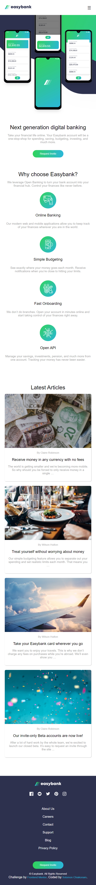

# Frontend Mentor - Easybank landing page solution

This is a solution to the [Easybank landing page challenge on Frontend Mentor](https://www.frontendmentor.io/challenges/easybank-landing-page-WaUhkoDN). Frontend Mentor challenges help you improve your coding skills by building realistic projects. 

### Screenshot

### Links
- Solution URL: [https://github.com/SoloBaChi/easy-banking-app.git](https://github.com/SoloBaChi/easy-banking-app.git)
- Live Site URL: [https://easybank-app.onrender.com/](https://easybank-app.onrender.com/)

### Built with

- Semantic HTML5 markup
- CSS custom properties
- Flexbox
- CSS Grid
- Mobile-first workflow or principle

## Author

- Website - [Solomon Chiakonam](https://solomon-chiakonam.onrender.com/)
- Frontend Mentor - [@SoloBachi](https://www.frontendmentor.io/profile/yourusername)
- Twitter - [@Solobachi](https://www.twitter.com/Solobachi)

